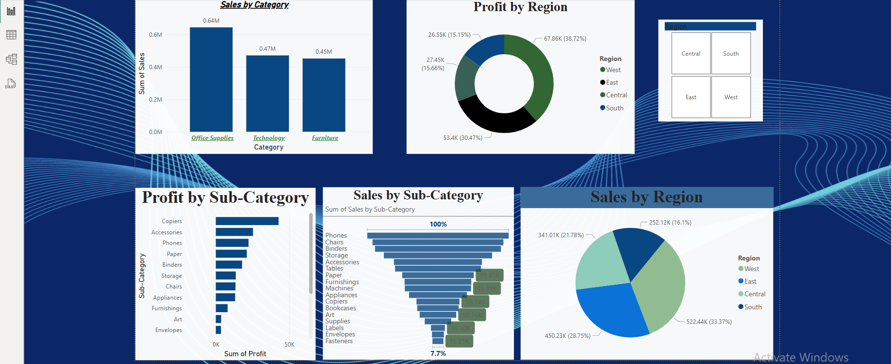

# 📊 Superstore Sales Dashboard - Power BI Project

This project presents an interactive Power BI dashboard for analyzing **Superstore Sales Data**, covering various performance metrics across regions, categories, and sub-categories.

## 📁 Dataset

The analysis is based on the `superstore_final_dataset.csv`, which contains transactional data from a fictional superstore including:

- Order Dates
- Product Categories and Sub-Categories
- Sales and Profit Figures
- Regional and Segment Information

> 📌 Dataset is included in this repository as: `superstore_final_dataset.csv`

---

## 🔍 Dashboard Insights

### 1. **Sales by Category**
Displays total sales across three primary categories:
- Office Supplies
- Technology
- Furniture

### 2. **Profit by Region**
A donut chart showing how profit is distributed across the four regions:
- West
- East
- Central
- South

### 3. **Sales by Sub-Category**
A horizontal bar chart representing the breakdown of sales by sub-category.

### 4. **Profit by Sub-Category**
Highlights the most and least profitable sub-categories using a vertical bar chart.

### 5. **Sales by Region**
Pie chart showing the total sales distribution among the four regions.

### 6. **Interactive Region Filter**
Users can filter the entire report by selecting a specific region using a quadrant-style slicer.

---

## 🛠️ Tools Used

- **Power BI Desktop** for dashboard development
- **Microsoft Excel / CSV** for data pre-processing
- **DAX** (Data Analysis Expressions) for creating custom measures and KPIs

